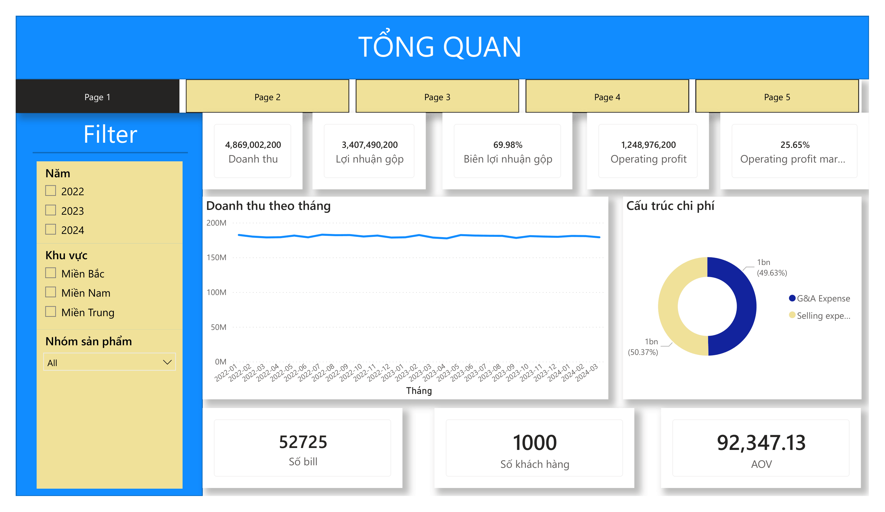

# Dashboard Báo cáo KQKD — Chuỗi bán lẻ 20 cửa hàng

Dashboard Power BI tổng hợp doanh thu, chi phí và lợi nhuận của một chuỗi bán lẻ 20 cửa hàng trong 27 tháng (01/2022 – 03/2024).

## Preview



## Dữ liệu

Dataset bán lẻ đã được mã hóa ẩn danh để phục vụ học tập. Tên sản phẩm, cửa hàng và loại chi phí được tác giả tự đặt theo bối cảnh chuỗi cửa hàng tiện lợi, giúp dashboard dễ đọc và có ý nghĩa khi trình bày.

- 27 file Excel theo tháng (format `YYYYMM.xlsx`)
- 20 cửa hàng, 30 sản phẩm, 20 loại chi phí
- Mỗi file có 2 sheet: `Bán hàng` và `Chi phí`

File được lưu trong 2 folder: `/2022_2023/` (data đã chốt) và `/2024/` (data đang chạy). Khi có tháng mới, chỉ cần thả file vào folder `2024` và Refresh — toàn bộ dashboard tự cập nhật.

## Các bước thực hiện

### 1. Load dữ liệu vào Power Query

Mở Power BI → **Transform data** → **New source** → chọn folder chứa các file Excel theo tháng. Power Query hiện cửa sổ chọn **Combine and Transform Data**.

Vì mỗi file gồm 2 sheet, xử lý từng sheet riêng:

**Sheet Bán hàng → bảng `F_Sales`:**

- Promote header tại tab Transform Sample File
- Set data types:
  - `Date` cho cột Ngày
  - `Text` cho các mã (bill, cửa hàng, sản phẩm, khách hàng)
  - `Whole Number` cho Số lượng, Giá bán sau KM, Đơn giá vốn
- Thêm 2 cột tính sẵn bằng **Add Column → Custom Column**:
  - `Doanh thu = Số lượng × Giá bán sau KM`
  - `Giá vốn hàng bán = Số lượng × Đơn giá vốn`
- Đổi tên bảng thành `F_Sales`

**Sheet Chi phí → bảng `F_Cost`:**

- Quy trình tương tự, rồi đổi tên thành `F_Cost`

**3 bảng dimension (`dim_cost`, `dim_product`, `dim_store`):**

- Load như bảng thông thường, set data types tương ứng

**Bảng `D_Date`:**

- Tạo bằng **New Table** với hàm DAX `CALENDAR(FIRSTDATE(F_Sales[Ngày]), LASTDATE(F_Sales[Ngày]))`
- Thêm 2 cột Năm và Tháng dùng `YEAR()` và `FORMAT()`

### 2. Thiết lập Relationships

Vào **Model view** kéo các quan hệ many-to-one từ fact sang dim:

**`F_Sales` liên kết với:**
- `dim_product` qua Mã sản phẩm
- `dim_store` qua Mã cửa hàng
- `D_Date` qua Ngày

**`F_Cost` liên kết với:**
- `dim_cost` qua Mã phí
- `dim_store` qua Mã cửa hàng
- `D_Date` qua Ngày

### 3. Viết các Measures bằng DAX

**Profitability (BCKQKD):**

```dax
Doanh thu = SUM(F_Sales[Doanh thu])

COGS = SUM(F_Sales[Giá vốn hàng bán])

Lợi nhuận gộp = [Doanh thu] - [COGS]

Selling Expense = 
CALCULATE(SUM(F_Cost[Chi phí]), dim_cost[Nhóm chi phí] = "Selling Expense")

G&A Expense = 
CALCULATE(SUM(F_Cost[Chi phí]), dim_cost[Nhóm chi phí] = "G&A")

Total Operating Expenditure = [Selling Expense] + [G&A Expense]

Operating Profit = [Lợi nhuận gộp] - [Total Operating Expenditure]

Biên lợi nhuận gộp = DIVIDE([Lợi nhuận gộp], [Doanh thu])

Operating Profit Margin = DIVIDE([Operating Profit], [Doanh thu])
```

**Sales volume:**

```dax
Số bill = DISTINCTCOUNT(F_Sales[Mã bill])

Số khách hàng = DISTINCTCOUNT(F_Sales[Mã khách hàng])

AOV = DIVIDE([Doanh thu], [Số bill])
```

**Cost efficiency & growth:**

```dax
Tổng chi phí / Doanh thu = DIVIDE([Total Operating Expenditure], [Doanh thu])

Tăng trưởng doanh thu = 
DIVIDE(
    CALCULATE([Doanh thu], D_Date[Năm] = 2023),
    CALCULATE([Doanh thu], D_Date[Năm] = 2022)
) - 1
```

### 4. Thiết kế Dashboard

Dashboard gồm 5 tab, mỗi tab có sidebar slicer riêng bên trái để filter linh hoạt:

- **Tab 1 — Tổng quan:** KPI chính (Doanh thu, GP, OP, các margin %) + line chart Doanh thu & Operating Profit 27 tháng + donut Selling vs G&A
- **Tab 2 — Phân tích theo cửa hàng:** So sánh Doanh thu và Operating Profit giữa 20 cửa hàng, với conditional formatting đỏ/xanh cho cửa hàng lỗ/lãi; phân bố theo khu vực; Matrix table chi tiết
- **Tab 3 — Phân tích sản phẩm:** Top 10 sản phẩm theo Doanh thu và theo Gross Profit; cơ cấu doanh thu/lợi nhuận theo 5 nhóm sản phẩm
- **Tab 4 — Cấu trúc chi phí:** Tỷ trọng Selling vs G&A; top các khoản chi phí lớn nhất; line chart xu hướng chi phí 27 tháng
- **Tab 5 — Xu hướng:** YoY Revenue Growth, Operating Margin theo năm, area chart timeline đầy đủ, seasonality theo tháng

## Một số insight chính

- Tổng doanh thu ~4.3 tỷ VND trong 27 tháng
- Tăng trưởng doanh thu 2023 vs 2022: **-0.29%** (gần như không đổi)
- Operating Margin 2023 vs 2022: **25.78% vs 25.47%** (+0.31pp)
- Selling và G&A gần cân bằng (50.1% vs 49.9%)
- Tổng chi phí vận hành chiếm **44% doanh thu**
- Miền Nam đóng góp 62% tổng doanh thu (12/20 cửa hàng tại TP.HCM)

## Hạn chế

- Dataset đã được anonymized; tên sản phẩm, cửa hàng, chi phí do tác giả tự gán
- Dữ liệu 2024 chỉ có 3 tháng, chưa thể so sánh năm full
- Chưa bao gồm phân tích cấp khách hàng

## Tác giả

**Tạ Minh Nhật**
Đại học Ngoại Thương Cơ sở II TP.HCM — Tài chính Ngân hàng Quốc tế
Email: nhatta607@gmail.com
